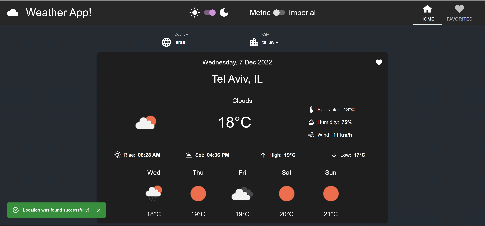
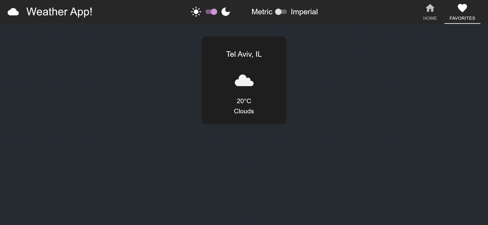

# Weather-App

## Table Of Contents
- [Weather-App](#weather-app)
  - [Table Of Contents](#table-of-contents)
  - [Introduction](#introduction)
  - [Technologies](#technologies)
  - [Installation](#installation)
  - [Screenshots](#screenshots)
    - [Home Page](#home-page)
    - [Favorites Page](#favorites-page)

## Introduction

Weather Application to view the weather of specific locations. 

## Technologies

* [React](https://reactjs.org/) v18.2.0
* [Material - UI](https://github.com/mui/material-ui) v5.10.15
* [Redux](https://github.com/reduxjs/redux-toolkit) v1.9.0
* [React-Redux](https://github.com/reduxjs/react-redux) v8.0.5
* [Redux-Persist](https://github.com/rt2zz/redux-persist) v6.0.0
* [Axios](https://github.com/axios/axios) v1.2.0
* [React-Router-Dom](https://github.com/remix-run/react-router) v5.2.0

## Installation

Use the package manager [npm](https://www.npmjs.com/) to install Weather-App.

```npm
git clone "https://github.com/yuvalitah/Weather-App.git"
cd ../path/to/the/file
npm install
```
To start the project
```npm
npm start
```

## Screenshots

### Home Page


### Favorites Page

